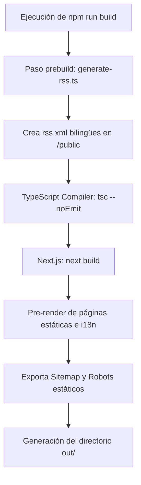

# Implementación de Exportación Estática Completa (`output: 'export'`)

Este documento detalla en profundidad los requerimientos de negocio, desafíos técnicos superados y las refactorizaciones de código realizadas para lograr que el portafolio sea 100% compatible con la exportación estática nativa de Next.js.

---

## 🎯 1. Objetivos y Requerimientos

El objetivo primordial del proyecto es la compilación a archivos estáticos puros (HTML, CSS, JS e imágenes) para posibilitar su distribución global vía CDN (ej. GitHub Pages), logrando costos de operación cero y una velocidad de carga óptima.

### Requerimientos Funcionales y No Funcionales Asociados:
*   **[RFG-05] Compilación 100% Estática**: Generar la totalidad de páginas y recursos visuales sin depender de procesos o bases de datos activas en runtime.
*   **[RNF-P1] Rendimiento**: Lograr un Lighthouse Score superior a 95 puntos en dispositivos móviles y de escritorio mediante pre-renderizado total.
*   **[RNF-P2] Build Offline**: Ejecutar la compilación (`npm run build`) de forma segura en entornos CI/CD (GitHub Actions) sin necesidad de red externa o dependencias activas del servidor en producción.

---

## 🚧 2. Desafíos Técnicos y Soluciones de Diseño

Next.js deshabilita por completo las capacidades dinámicas de Node.js en producción cuando se activa la directiva `output: 'export'`. Esto introdujo cuatro retos principales que fueron resueltos en esta iteración:

### Desafío A: Seguridad y Rutas Protegidas (`RouteGuard`)
*   **Problema**: La versión previa de la plantilla dependía de llamadas HTTP a `/api/check-auth` y `/api/authenticate`. En un entorno estático, estas llamadas fallarían con código `404` al no existir un backend activo.
*   **Solución**: Se migró la verificación al cliente. El componente `RouteGuard.tsx` ahora valida la contraseña directamente contra la variable de entorno `NEXT_PUBLIC_PAGE_ACCESS_PASSWORD` (inyectada en el bundle durante la compilación) y almacena un token de sesión seguro `"authenticated"` en `localStorage`.

### Desafío B: Sindicación y Feed RSS
*   **Problema**: La ruta de API `/api/rss/route.ts` no se exporta a la raíz del dominio como un recurso XML físico usable por lectores RSS tradicionales en modo estático.
*   **Solución**: Creamos un script Node de construcción (`src/scripts/generate-rss.ts`) ejecutado en la fase de `prebuild`. Este script lee los ViewModels bilingües del blog y escribe físicamente los archivos `rss.xml`, `rss-es.xml` y `rss-en.xml` en la carpeta `/public/`. Next.js luego los copia a la raíz de la compilación (`out/`).

### Desafío C: Metadatos Dinámicos Open Graph (OG Images)
*   **Problema**: El endpoint `/api/og/generate?title=...` realizaba generación dinámica de imágenes SVG/PNG usando Satori y reservers edge runtime, requiriendo un servidor de Node en vivo.
*   **Solución**: Reemplazamos las peticiones al endpoint por imágenes estáticas ya existentes o por la imagen de portada de cada post. La imagen por defecto `/images/og/home.jpg` sirve como fallback para páginas de índice globales.

### Desafío D: Sitemap y Robots
*   **Problema**: Los archivos `/sitemap.xml` y `/robots.txt` son dinámicos en el App Router de Next.js y provocaban errores de compilación estática si no se configuraban explícitamente.
*   **Solución**: Se forzó la compilación estática añadiendo la instrucción `export const dynamic = "force-static";` en la cabecera de `src/app/sitemap.ts` y `src/app/robots.ts`.

---

## 🛠 3. Detalle de Cambios Realizados

A continuación se enlistan los archivos modificados para lograr la compatibilidad:

### 1. `next.config.mjs`
*   Activación de la exportación estática: `output: "export"`.
*   Desactivación del optimizador de imágenes dinámico en runtime: `images: { unoptimized: true }`.
*   Asegurar resolución de carpetas físicas al hacer refresh: `trailingSlash: true`.

### 2. `package.json`
*   Inclusión del script de sindicación automatizado:
    ```json
    "prebuild": "npx tsx src/scripts/generate-rss.ts"
    ```

### 3. `src/scripts/generate-rss.ts` [NUEVO]
*   Script independiente que importa la lógica del ViewModel de blog localmente sin disparar dependencias visuales de Next.js o llamadas a fuentes de Google (bypasseando `next/font/google` mediante lectura síncrona con `fs`).

### 4. `src/components/RouteGuard.tsx`
*   Remoción completa de las llamadas asíncronas a APIs de autenticación de Node.js.
*   Implementación de persistencia y comprobación en cliente:
    ```typescript
    const correctPassword = process.env.NEXT_PUBLIC_PAGE_ACCESS_PASSWORD;
    if (correctPassword && password === correctPassword) {
      localStorage.setItem("authToken", "authenticated");
      setIsAuthenticated(true);
    }
    ```

### 5. Páginas del Sitio (`src/app/[locale]/...`)
*   Se eliminó la llamada a `/api/og/generate` en:
    *   `about/page.tsx`
    *   `blog/page.tsx`
    *   `gallery/page.tsx`
    *   `work/page.tsx`
    *   `blog/[...slug]/page.tsx`
    *   `work/[...slug]/page.tsx`
    *   `page.tsx`

---

## 🚀 4. Flujo de Compilación y Despliegue



Con esta implementación, la compilación de Next.js se reduce a un artefacto HTML5/CSS3 puro listo para ser subido a cualquier servidor web estático sin requerir configuraciones complejas de backend en el servidor destino.

---

## 🔍 5. Concepto Clave: `trailingSlash: true` y la prevención de Errores 404

### ¿Qué problema resuelve?
Por defecto, Next.js compila las páginas a nombres de archivos directos. Por ejemplo:
*   La ruta `/es/about` se compila a un archivo físico llamado `out/es/about.html`.

Durante la navegación interna en la página, Next.js intercepta los enlaces y los maneja mediante JavaScript (sin recargar la pestaña del navegador), por lo que funciona correctamente. Sin embargo, si un usuario **refresca el navegador (F5)** en la URL `tudominio.com/es/about` o ingresa directamente a ese enlace:
1.  El navegador web realiza una petición directa al servidor físico de la CDN (como GitHub Pages) buscando la carpeta `/es/about`.
2.  Dado que los servidores estáticos no tienen un backend de Node para resolver rutas dinámicamente o aplicar reglas de reescritura automáticas, el servidor no puede mapear `/es/about` hacia `/es/about.html`.
3.  El servidor responde con un **Error 404 (Recurso no encontrado)**.

### ¿Cómo lo soluciona `trailingSlash: true`?
Al activar esta propiedad, obligamos a Next.js a guardar los recursos estructurándolos como directorios físicos con un archivo `index.html` adentro:
*   En lugar de crear `out/es/about.html`, genera la estructura de carpetas: **`out/es/about/index.html`**.

Todos los servidores estáticos del mundo (GitHub Pages, Amazon S3, Netlify, etc.) están diseñados de forma predeterminada para que, al solicitar un directorio (como `/es/about/`), busquen de forma interna y sirvan el archivo `index.html` de su interior.

De esta forma, al refrescar la página en `tudominio.com/es/about/`, el servidor estático encuentra instantáneamente su `index.html` correspondiente, evitando el fallo de carga 404 y garantizando un enrutamiento robusto.

