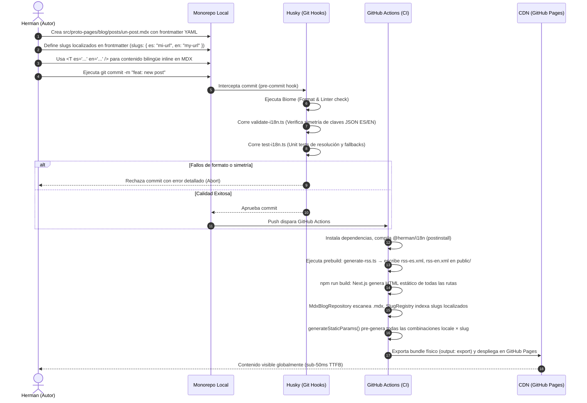

# Global Process 01: Publicación de Contenidos Técnicos (MDX)

## Objective

Describir el flujo transversal de extremo a extremo que realiza el Autor para redactar, validar de forma automatizada, compilar sin dependencias de red y desplegar un nuevo artículo de blog o proyecto de portafolio en producción.

---

## Participating Layers

- **Infraestructura** (`src/infrastructure/blog/`, `src/infrastructure/portfolio/`): Lee los archivos `.mdx` del filesystem y construye entidades del dominio a través de los adaptadores de repositorio (`MdxBlogRepository`, `MdxProjectRepository`).
- **Aplicación** (`src/application/blog/`, `src/application/portfolio/`): Los Casos de Uso (`GetBlogListUseCase`, `GetBlogPostUseCase`, etc.) orquestan la consulta y devuelven DTOs listos para la presentación.
- **Presentación / MVVM-C** (`src/presentation/`): Los Coordinators instancian los Casos de Uso con los repositorios correctos. Los ViewModels transforman DTOs en estado visual para los View Components.
- **DevOps / Shared**: Pipeline de compilación y calidad — Git Hooks (Husky, lint-staged), Biome, y CI/CD de GitHub Actions hacia la CDN.

---

## Sequence Diagram (Build & Deploy Flow)



---

## Main Flow (Paso a Paso)

### 1. Redacción del Artículo

- **Actor:** Autor
- **Ubicación:** `src/proto-pages/blog/posts/` (blog) o `src/proto-pages/work/projects/` (portfolio)
- **Frontmatter obligatorio:**
  ```yaml
  ---
  title:
    es: "Mi Artículo"
    en: "My Article"
  description:
    es: "Descripción"
    en: "Description"
  publishedAt: "2026-06-10"
  tags: ["typescript", "ddd"]
  featured: false
  slugs:
    es: "mi-articulo"
    en: "my-article"
  ---
  ```
- Si `slugs` se omite, el nombre del archivo actúa como slug universal (retrocompatibilidad).
- Contenido bilingüe inline: `<T es="Ver más" en="See more" />`

### 2. Validación Local (pre-commit)

- **Actor:** Husky + lint-staged
- `biome format --write` sobre archivos modificados.
- `validate-i18n.ts`: verifica simetría de claves entre `lang/es/` y `lang/en/`.
- `test-i18n.ts`: unit tests de `getDictionary`, `resolveKey`, `getNestedValue` del paquete `@herman/i18n`.
- Si cualquier check falla → commit abortado con mensaje de error.

### 3. Compilación Estática (`npm run build`)

- **Actor:** GitHub Actions Runner
- `postinstall` → compila `packages/i18n/` con `tsc` generando `dist/`.
- `prebuild` → `generate-rss.ts` ejecuta `GetBlogListUseCase` con `MdxBlogRepository` y escribe `public/rss-es.xml` y `public/rss-en.xml`.
- `next build` → escanea todos los `.mdx`, construye entidades `Article`/`Project`, resuelve slugs localizados via `SlugRegistry`, pre-genera todas las rutas con `generateStaticParams()`.
- Salida: carpeta `out/` con HTML + CSS + JS puros.

### 4. Despliegue en CDN

- **Actor:** GitHub Actions → GitHub Pages
- Los archivos de `out/` se publican en la CDN de GitHub Pages.
- Rama de despliegue: `publish`.

---

## Risks and Considerations

- **Frontmatter inválido o incompleto**: Si falta un campo obligatorio (ej: `publishedAt`), `MdxBlogRepository` no puede construir la entidad `Article` y el build falla en tiempo de compilación — protegiendo producción.
- **Slug duplicado**: Si dos posts tienen el mismo `slug.es` o `slug.en`, `SlugRegistry` lanzará error en build-time — no hay colisiones silenciosas en runtime.
- **`slugs` ausente en frontmatter**: El nombre del archivo actúa como slug universal para todos los idiomas (modo retrocompatible). Agregar `slugs` cuando se quiera URL semánticamente localizada.

---

[back](./readme.md)
